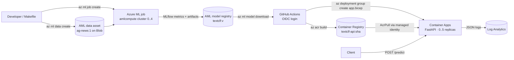

# azure-pytorch-mlops

[](https://github.com/Pablinki/azure-pytorch-mlops/actions/workflows/ci.yml)


`textclf` is a news-topic classifier (AG News, 4 classes) implemented as a **TextCNN in plain PyTorch**,
trained as an **Azure Machine Learning** job with MLflow tracking and a model registry, and served as an
**autoscaling FastAPI service on Azure Container Apps** (scale-to-zero). Infrastructure is **Bicep**; delivery is
**GitHub Actions with OIDC** (no stored cloud secrets). The codebase is small on purpose: one package, one CLI,
one config schema, a typed exception hierarchy enforced by linting and tests.

## Architecture



| Concern | Choice | Why |
|---|---|---|
| Model | TextCNN in plain PyTorch (`nn.Embedding` → 3 parallel `Conv1d` → max-over-time → linear) | Trains on CPU in minutes; shows a real training loop instead of a one-line fine-tune |
| Training | Azure ML command job on an `amlcompute` cluster (min 0, max 4) | Managed, autoscaling, MLflow tracking built in |
| Tracking / registry | MLflow (`azureml-mlflow`) + AML model registry | Same code logs locally (sqlite) and in the cloud (workspace) |
| Serving | FastAPI + Uvicorn on Azure Container Apps, HTTP-concurrency scale rule, `minReplicas: 0` | Serverless containers with KEDA autoscaling; no Kubernetes to operate |
| Model delivery | CI downloads the registered model and bakes it into the image | Immutable artifact, fastest cold start, no runtime storage credentials |
| IaC | Bicep: `main.bicep` (platform) + `app.bicep` (container app, redeployed by CI) | Azure-native, no state backend to manage |
| CI/CD | GitHub Actions, `azure/login` with OIDC, `az acr build` | Zero stored cloud secrets, no Docker needed on the runner |
| Observability | JSON logs → Log Analytics; `/health` + `/ready` probes; `x-request-id` on every response | Enough to debug production without an APM |

Every decision has a short entry in [docs/DECISIONS.md](docs/DECISIONS.md).

## Quickstart (local, CPU)

```bash
make setup          # uv sync --all-extras + pre-commit install
make prepare-data   # AG News -> data/ag_news/{train,test}.parquet + labels.json (120 000 / 7 600 rows)
make train-local    # 1 epoch on 5 000 rows (~15 s on a laptop CPU) -> outputs/model/
make serve          # FastAPI on http://127.0.0.1:8000
curl -s -X POST localhost:8000/predict -H 'content-type: application/json' \
  -d '{"texts":["Stocks rally as tech earnings beat expectations","Real Madrid wins the derby in extra time"]}'
```

`make check` runs ruff (with the `BLE`/`TRY` exception rule sets), `mypy --strict` and pytest with a coverage gate.
Full training locally: `uv run textclf train` (5 epochs on 120 000 rows, a few minutes on CPU).
Evaluation on the test split: `uv run textclf evaluate --model-dir outputs/model --data-dir data/ag_news`.

## Cloud walkthrough

Copy `.env.example` to `.env`, run `az login`, then:

| Command | What it does |
|---|---|
| `make provision` | Resource group + `what-if` for `infra/main.bicep`; then `az deployment group create` (see Makefile) |
| `make compute` | `amlcompute` cluster `cpu-cluster`, `min_instances: 0` |
| `make env` | Builds the training image (`aml/Dockerfile.train`) inside the workspace ACR |
| `make data` | Uploads `data/ag_news` as data asset `ag-news:1` |
| `make submit` | Submits `aml/job.yaml` and streams the logs |
| `make register JOB=<job name>` | Registers the job output as model `textclf:<version>` |
| `make deploy` | `az acr build` the serving image (tag = git SHA) and redeploy `infra/app.bicep` |
| `make destroy` | Deletes the resource group: stops all billing |

Merging to `main` runs the same deploy through `.github/workflows/deploy.yml` with an OIDC federated
credential (setup commands in the workflow header and in the build plan).

## Design notes

### Exception handling is a design concern

All package errors derive from `MLProjectError` ([src/textclf/exceptions.py](src/textclf/exceptions.py)):
`ConfigError`, `DataError`, `ModelError`, `TrainingError` (+ `CheckpointError`), `InferenceError`
(+ `ModelNotReadyError`), `AzureError`. Third-party exceptions never escape a module (`raise X(...) from e`),
and errors are caught at exactly three boundaries:

1. the CLI ([cli.py](src/textclf/cli.py) `_run`): log once with the traceback, exit with a stable code;
2. the API ([api/app.py](src/textclf/api/app.py) exception handlers): HTTP status + JSON body + request id;
3. the MLflow run context in [train.py](src/textclf/train.py): the run is marked `FAILED` and the error re-raised.

Only transient failures are retried ([retry.py](src/textclf/retry.py): connection errors, timeouts,
HTTP 408/429/5xx, bounded exponential backoff with jitter). Training failure modes are explicit: non-finite
loss, CUDA OOM (with an actionable hint), checkpoint I/O (atomic writes), SIGTERM/SIGINT (checkpoint, then
`--resume-from`). ruff's `BLE` and `TRY` rule sets and 146 tests enforce the contract.

### Scalability levers

| Lever | Where |
|---|---|
| Batch size, AMP, dataloader workers | `configs/train.yaml` → `train.batch_size`, `train.amp`, `data.num_workers` |
| Training cluster size | `aml/compute.yaml` → `max_instances`; VM SKU → `size` |
| GPU training | swap `aml/Dockerfile.train` base image for the CUDA one and `size` for `Standard_NC4as_T4_v3`; AMP turns on automatically on CUDA |
| API replicas | `infra/app.bicep` → `minReplicas`, `maxReplicas`, `concurrentRequests` (KEDA HTTP rule) |
| CPU threads / workers per replica | `TEXTCLF_TORCH_THREADS`, `TEXTCLF_WORKERS` environment variables |
| Request batching | `TEXTCLF_MAX_BATCH_SIZE`; the schema caps a request at 64 texts |

## Evidence

Local (Windows 11 laptop, CPU), captured in [docs/evidence/](docs/evidence/):

| Item | Value | Source |
|---|---|---|
| `make prepare-data` | 120 000 train / 7 600 test rows in 1m40s | `phase2-prepare-data.txt` |
| `make train-local` (1 epoch, 5 000 rows) | val accuracy 0.658, val macro-F1 0.642, 15 s wall clock | `phase3-train-local.txt` |
| Test split after that smoke run | accuracy 0.676, macro-F1 0.662 | `phase3-train-local.txt` |
| MLflow run | params, per-epoch metrics, five artifacts attached | `phase3-train-local.txt` |
| Local API | `/ready` 200, `/predict` labels + request id, JSON logs | `phase6-local-serve.txt` |
| Quality gates | ruff clean, mypy strict clean, 146 tests, 96.5 % coverage | `phase6-local-serve.txt` |

Cloud evidence (Azure ML job, registered model, Container Apps revision, scale-to-zero, load test, CI run) is
added to this table as each billable phase runs; see the "Cost and teardown" section.

## What this project demonstrates

- A complete PyTorch training loop: AMP on CUDA, gradient clipping, early stopping, atomic checkpoints,
  preemption-safe resume, MLflow tracking that works identically on a laptop and inside an Azure ML job.
- A typed domain-exception hierarchy with three catch boundaries, enforced by ruff (`BLE`, `TRY`) and tests
  that assert on exception types and `context`.
- Validation before compute: pydantic config with `extra="forbid"`, dataset schema checks, artifact checks.
- Azure ML jobs + MLflow + model registry, with the registered model baked into an immutable SHA-tagged image.
- Azure Container Apps with KEDA autoscaling and scale-to-zero, liveness/readiness probes, managed identity
  for ACR pulls (no registry passwords).
- Infrastructure as code with Bicep, and CI/CD with GitHub Actions + OIDC federated identity (no long-lived
  cloud secrets anywhere).
- Operable service: JSON logs to Log Analytics, `x-request-id` on every response, error bodies that never leak
  internals.
- 146 offline tests running in about 10 s, coverage above 95 %, `mypy --strict`.

## Cost and teardown

Every resource is configured to cost ~0 while idle: the AML cluster has `min_instances: 0`, the container app
has `minReplicas: 0`, the ACR is `Basic` (~$0.17/day) and Log Analytics bills per ingested GB. A full training run
on `Standard_DS3_v2` costs cents. `make destroy` deletes the resource group; re-running `make provision`
recreates everything from Bicep.
